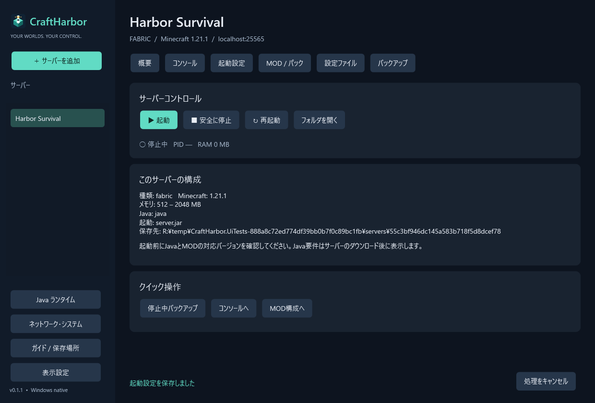

# ◈ CraftHarbor

**サーバーのための、小さな港。** Windows向けのMinecraft Java Editionサーバー管理アプリです。C# / WPFで作り、ブラウザエンジンやNode.jsを同梱しません。



## ダウンロード

[GitHub Releases](https://github.com/ryuya0124/CraftHarbor/releases) の `CraftHarbor-0.1.5-win-x64-portable.zip` を展開し、`CraftHarbor.exe` を実行してください。軽量版には **.NET 10 Desktop Runtime x64** が必要です。.NETがないPCでは `standalone.zip` を選べます。どちらも管理者権限不要です。

**v0.1.5 / プレビュー**。MOD設定の保存場所・形式を拡張し、プリセット切替で既存設定を残せるようにしました。[MOD設定の保持](docs/MOD_CONFIGURATIONS.md)。[AutoModpackとの併用](docs/AUTOMODPACK.md) / [MOD・設定の検証記録](docs/FEATURE_VALIDATION.md) / [サーバー本体の検証記録](docs/REAL_SERVER_VALIDATION.md)。すべてのMOD・パック・サーバー実装を自動的に扱える製品ではありません。

## できること

| 分野 | 対応 |
|---|---|
| 表示 | ダーク／ライト切替・保存、テーマ対応の選択欄・内部ダイアログ、専用アイコン |
| サーバー | 複数プロファイル、起動・通常停止・再起動・明示的な強制終了 |
| 自動導入 | Vanilla / Paper / Fabric / Folia。バージョン選択、Fabricローダー固定 |
| 既存環境 | 停止済みサーバーフォルダのコピー。Forge / NeoForge / Quilt / 独自JARのJava起動引数 |
| Java | 既存Javaの検出、Temurin JRE 8 / 11 / 17 / 21 / 25の専用フォルダ導入・サーバー別割当 |
| コンソール | 標準出力・エラー、コマンド送信、list / save-all / whitelist list、永続ログ |
| MOD / plugins | ローカルJAR追加、有効・無効切替、フォルダ参照 |
| Modrinth | MC・ローダーで絞り込むMOD検索、必須依存解決、導入予定確認、SHA512検証 |
| MODパック | `.mrpack` の必須サーバーファイルとoverrides。Fabric指定版の引継ぎ |
| プリセット | JAR・MOD設定をZIP保存。既存設定を維持／同名設定を復元。切替前に全体バックアップ |
| 設定 | JSON / TOML / YAML / properties / txt / confを編集、JSON構文検証、旧版保存 |
| バックアップ | 停止中の全体ZIP、ステージング復元、復元前フォルダの保存 |
| 情報 | OS・論理CPU数・メモリ指標・ディスク空き・LAN IPv4・TCP待受・疎通 |

## 最初の起動

1. 「サーバーを追加」で名前を決めます。
2. 「起動設定」で種類・Minecraftバージョンを選び、本体を導入します。
3. 「Java ランタイム」で必要なJavaを導入し、左側のサーバーへ割り当てます。
4. 起動設定でメモリ・ポートを調整し、Minecraft EULAを読んで同意します。
5. 「概要」から起動。「コンソール」の `Done` を確認して接続します。

既存サーバーを遊びながらCraftHarborを試せます。**別アプリから起動されたJavaプロセスには接続・停止しません。** 既存フォルダを取り込む場合だけ、元のサーバーを停止できる時間にコピーしてください。

## ドキュメント

- [操作ガイド](docs/USER_GUIDE.md)：導入、コンソール、MOD、Java、プリセット
- [運用・復旧ガイド](docs/OPERATIONS.md)：データ、バックアップ、ネットワーク、故障時
- [対応表・制約](docs/SUPPORT.md)：自動対応と手動対応の区別
- [開発ガイド](docs/DEVELOPMENT.md)：構成、ビルド、テスト、配布
- [検証記録](docs/VALIDATION.md)：実施したテストと未検証事項
- [設計](docs/ARCHITECTURE.md) / [ロードマップ](docs/ROADMAP.md) / [変更履歴](CHANGELOG.md)

## データとプライバシー

既定保存先は WindowsのDocuments配下 `CraftHarbor/data`。ソースやEXEと別に保存するため、アプリ更新でワールドが消えません。`CRAFTHARBOR_DATA` 環境変数で変更できます。アカウント登録、テレメトリー、常駐Webサーバーはありません。ダウンロード・検索時に該当配布APIへ接続します。

## ビルド

Windows、.NET 10 SDKを使用します。NuGetの追加実行時依存はありません。

```powershell
dotnet build src/CraftHarbor.Desktop -c Release
dotnet run --project tests/CraftHarbor.Tests -c Release
dotnet run --project tests/CraftHarbor.UiTests -c Release
./scripts/package.ps1
```

## ライセンス

CraftHarborのコードはMIT。Minecraft、MOD、Java等のダウンロード物には各配布元のライセンス・EULAが適用されます。Mojang / Microsoftの公式製品ではありません。ServerStarter2のコード・画像を流用していません。
