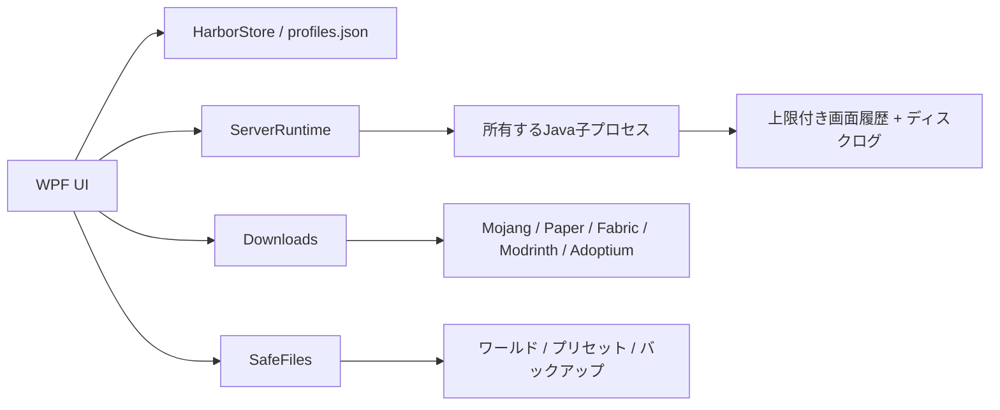

# 設計

## アプリ境界

WPFの単一デスクトッププロセスから、サーバーごとのJava子プロセスを起動します。標準入力・出力・エラーをリダイレクトします。ローカルHTTPポートは開きません。Mutexで同じWindowsセッション内のアプリ多重起動を抑止します。

## プロセス所有

ServerRuntimeは自分で生成したProcessハンドルだけを保持します。PID一覧からJavaを一括停止する処理はありません。起動前に指定TCPポートの競合を読み取り確認し、競合時には新しい起動を拒否します。

終了はstopの標準入力送信→出力の排出→終了コード取得。強制終了はUIで確認した対象の子プロセスツリーだけに対して行います。通常のウィンドウ終了は稼働中・処理中なら拒否します。アプリのクラッシュ後に外部で残ったプロセスへの再接続はありません。

## ファイル操作

相対パスは絶対化してroot配下であることを検証し、NTFSストリーム、ルート外参照、既存reparse pointを拒否します。ZIPはエントリ名と展開サイズ・数を検証し、リンクを拒否します。ローカルの別プロセスによる検証直後のファイル置換まで防ぐサンドボックスではありません。

JSON・設定保存は隣接一時ファイルからrename。ダウンロードはpartialへストリーム保存し、長さと配布ハッシュを確認してからrename。バックアップZIPは完成するまでpartial。復元は別ツリーへ展開完了後に切り替え、前のツリーを保持します。

プリセットはModConfigurationsの許可範囲を検証し、全体バックアップ後にmods/plugins直下のJARを切り替えます。設定は既存優先（標準）またはプリセット優先でファイル単位に追加・上書きし、未収録ファイルを削除しません。例外時は全体バックアップから復元します。プロセス停止中の操作だけをUIから許可します。MOD群は全ファイルを取得してから移動し、途中の移動失敗時は移動済み分を戻します。

## 配布物の検証

VanillaはMojangのSHA1、JavaはSHA256、ModrinthはSHA512を使います。PaperはAPIにchecksums.sha256がある場合に検証します。FabricランチャーはHTTPSで取得し、APIにハッシュがないため本版では独立したハッシュ照合をしません。ダウンロードは1ファイル4GBまでです。

mrpackの外部ファイルはhttpsのcdn.modrinth.comに限定します。HTTPSリダイレクト先の最終URLも確認しますが、Downloadsは汎用ネットワーク隔離サンドボックスではありません。MOD・JAR自体はMinecraftと同じユーザー権限で動く実行コードです。

## 初版のUI構成

MainWindowはコード生成の10画面と共通スタイルで構成しています。初版の依存関係を減らすため外部MVVMライブラリは使用していません。ページ単位のViewModelへの分割、ジョブ単位の操作ロック、ジョブ復旧は今後の拡張項目です。

v0.1.1ではStyles.xamlのDynamicResourceとThemeの共通パレットで配色を管理します。コード生成UIのブラシは弱参照で保持して即時更新し、サーバーや入力内容を作り直さずテーマを変更します。表示設定はprofiles.jsonとは独立したsettings.jsonに保存します。通常の通知・確認にはテーマ対応のHarborDialogを使用し、OSのファイル選択画面はそのまま利用します。
